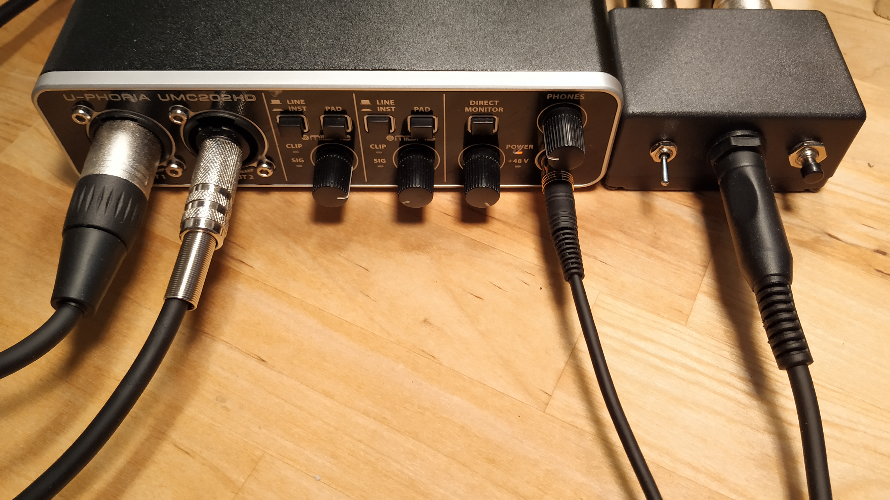
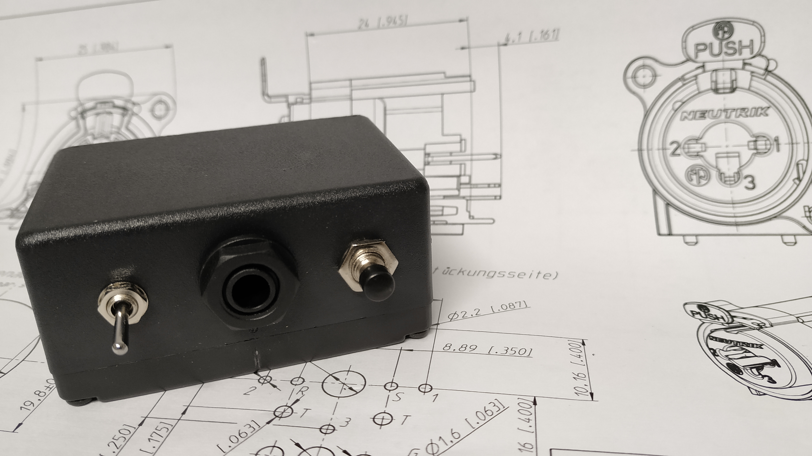
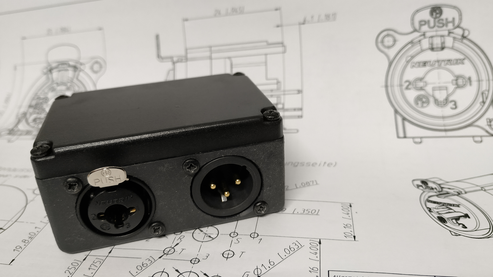
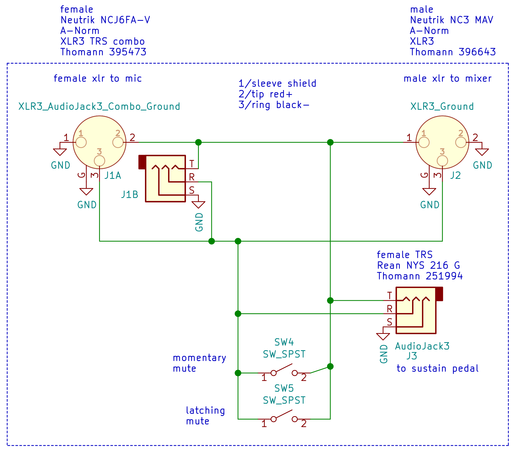
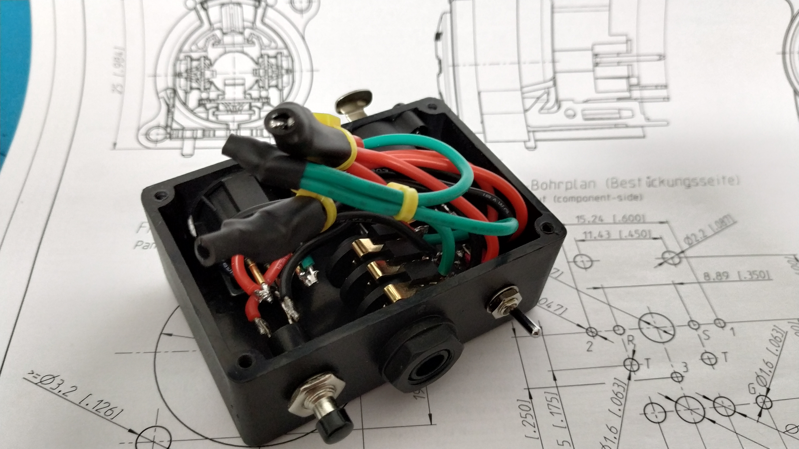

# XLR mute

A small DIY hardware solution to mute a microphone in more than one way.

## Disclaimer

The circuit has been tested successfully with a XM8500 dynamic microphone and should work with other dynamic microphones or electric guitars etc.
For other types of microphones do your research first.

## Motivation / Use-case

In a remote teaching scenario from the home office, the usual ways to mute the microphone sometimes won't work quickly enough, if at all. The video conferencing software may be in the background because you are sharing some other application window. Or the keyboard and mouse are captured by a virtual machine with some niche OS which has no support for guest extensions. Either way, chances are you are not quick enough to mute the microphone the software way before your little ones disclose private details your students truly neither need nor want to know.

Sometimes you might even hold something in front of a detail camera that you can't put down quickly. This is where hands-free operation would be useful.

## Features

The XLR mute box has the following features:

- Permanent mute toggle switch
- Momentary mute push button
- External foot pedal connection for 
  - Push to talk (pedal switch NC)
  - Push to mute (pedal switch NO)

Any off the shelf foot pedal (sustain pedal) can be used. See Schematics for details.

## Connectors

- XLR female/6.25mm TRS combo port (input)
- XLR male (output)
- 6.25mm TRS jack (foot pedal)

The connectors are all in parallel, thus either of the connectors could serve as input, output, or mute switch connection.

## Schematics

The [schematics](./xlr-mute.pdf) is as simple as it gets. The audio connectors are wired in parallel. To mute the microphone, the hot and cold wire are shorted together. The various mute switches are simply wired in parallel to the hot (+) and cold (-) signal lines.

The box will mute the microphone if at least one of the options says mute (wired logical OR). A generic sustain pedal works as external mute switch. If you get one that can be switched between NO and NC you can choose between push to mute and push to talk. Please be aware that sustain pedals usually come with a mono (TS) connector which will short the cold end of the balanced input to ground. This is absolutely no problem with a XM8500 dynamic microphone and a UMC202HD audio interface, but YMMV.

## Construction

The circuit can be realized by simply soldering wires to the connectors and switches. A metal box is recommended for better shielding against RMI and increased robustness. With the right (foot) switches mounted on top, it could even be used on stage to mute an electric guitar as part of a pedal board.

There are no exotic parts in the build. For the box in the pictures, the audio connectors are from Neutrik and Rean (a Neutrik company). These are available from various sources, one of which is given in the schematics. Don't forget the screws for the XLR connectors! The enclosure and switches are from the author's parts bin.

To get the holes in the enclosure right, print the hole template, stick it to the enclosure and mark the hole centers with a sharp, pointy object. You only need two small opposing holes per connector, the pattern has four circles to allow different mounting options. Use a stepped drill bit for the large holes (final hole diameter 22mm). The smaller holes are supposed to be 3.2mm in diameter, a 3mm drill in combination with the plastic enclosure worked as well.

Also, make sure your enclosure is large enough to fit the parts and wiring!

## License

 This work is licensed under a <a rel="license" href="http://creativecommons.org/licenses/by-sa/4.0/">Creative Commons Attribution-ShareAlike 4.0 International License</a>.